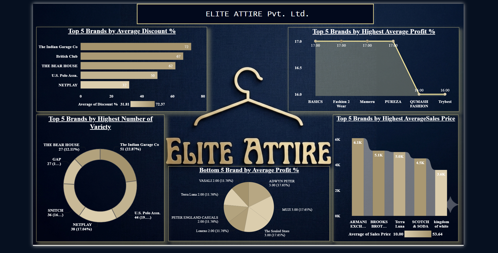

# 👔 Brand & Sales Performance Analysis – Elite Attire

---

### Dashboard Link: [Insert Your Power BI Public/Service Link Here]

---

## Problem Statement

Elite Attire needed a consolidated sales intelligence platform to track pricing strategies, discount percentages, brand-level revenue distribution, and product assortment across 1,400+ men's apparel SKUs.

By processing raw retail transaction data through SQL Server queries and Power BI DAX modeling, this dashboard enables category managers to analyze brand performance, evaluate discount margins, and optimize inventory pricing.

---

## Data Analytics Workflow
Apparel Sales Dataset ──► SQL Server / Power Query Cleaning ──► DAX Modeling & Measures ──► Interactive Retail Dashboard ──► Business Insights

## Key Metrics & DAX Measures

- **Total Brands**: Count of unique apparel brands offering active SKUs.
- **Average Discount %**: Evaluated pricing aggressiveness across brand categories.
- **Average Price**: Tracked baseline vs. discounted selling prices.
- **SKU Count by Brand**: Monitored product depth and brand coverage.

---

# Snapshot of Dashboard

### Brand & Sales Performance Overview

### Product Pricing & Discount Analysis

---

# Key Insights

* **Discount Strategy Evaluation**: Higher discount percentages were correlated with volume movement across key apparel categories, highlighting optimal promotional price points.
* **Brand Assortment Leaders**: Top-performing brands contributed disproportionately to total catalog coverage, indicating clear category dominance.
* **Price Realization**: Tracking average original prices vs. final sales prices revealed margin compression patterns across specific SKU tiers.
